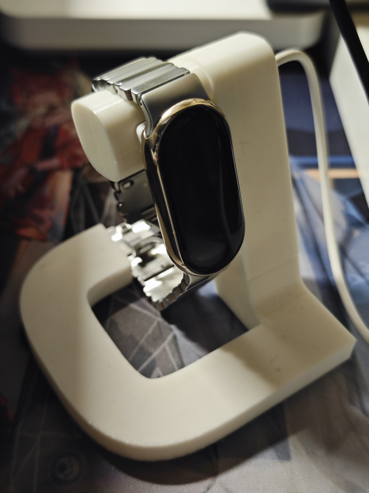

#### 小米手环 8/8 NFC 充电支架

  
   

适用于小米手环 8/8 NFC 版本的3D打印充电支架。

**注意**：由于小米手环 9 及更高版本的触点位置发生了改变，需要对模型进行镜像对称修改。

#### 设计

- **小米 Logo 风格设计**：小米 Logo 的连续曲率超椭圆设计
- **打印优化**：打印瑕疵面隐藏在支架连接处内部
- **拼接设计**：采用拼接结构设计，避免因单一打印方向导致层纹明显
